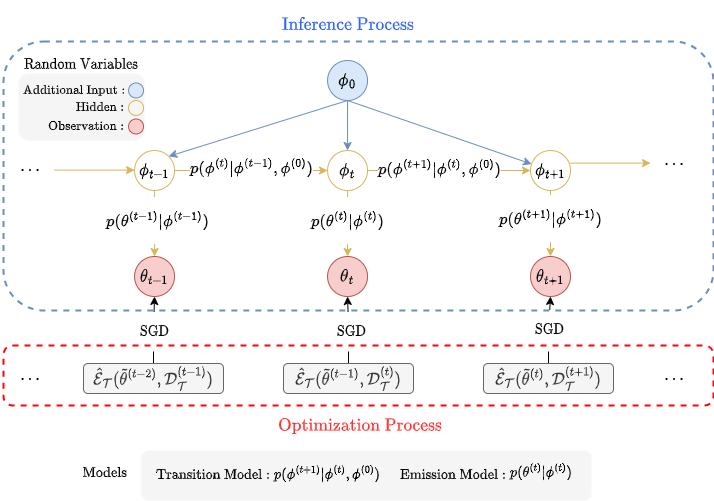
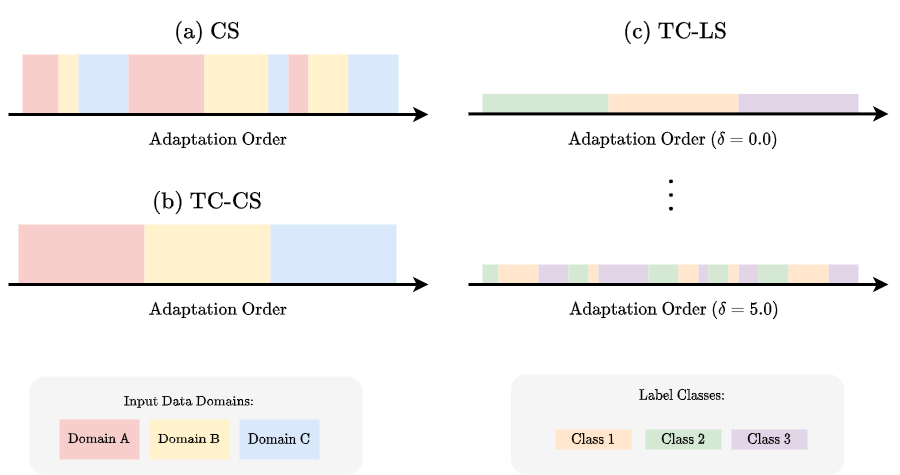

# Continual Momentum Filtering on Parameter Space for Online Test-time Adaptation

Continual Momentum Filtering (CMF) is a novel approach to bolster the OTTA methodology. CMF infers a refined source model through target model denoising by leveraging the Kalman filter. The refined source model is ensembled with the target model for the OTTA procedure. By streamlining the Kalman filter algorithm, the computational overheads were minimized, underpinning the pragmatic nature of the CMF.



## Download Datasets
- [ImageNet-C](https://zenodo.org/record/2235448#.Yj2RO_co_mF) contains 1,281,167/50,000 training/testing data respectively. ImageNet-C is a dataset applied to ImageNet according to 15 types of damage (gaussian noise, shot noise, impulse noise, defocus blur, glass blur, motion blur, zoom blur, snow, frost, fog, brightness, contrast, elastic transform, pixelate, and jpeg compression) at five severity levels.
- [Rendition](https://github.com/hendrycks/imagenet-r) included 30,000 images with various artistic renderings of 200 ImageNet classes, primarily collected from Flickr and filtered by Amazon MTurk annotators.
- [Sketch](https://github.com/HaohanWang/ImageNet-Sketch) consists of 50,000 images, with 50 images for each of the 1,000 ImageNet classes. This dataset is constructed from Google image queries with the standard class name "sketch of" and is only searched within the "black and white" color scheme.
- [D109]() is a dataset concerning natural distribution shifts. This dataset consists of five domains (clipart, infograph, painting, real, and sketch). D109 classes were based on [DomainNet (cleaned)](http://ai.bu.edu/M3SDA/), including 109 classes that overlapp with ImageNet. D109 is automatically generated when running code based on DomainNet.

## Source Models
The following models are officially provided by torchvision and Huggingface and are automatically downloaded when the code is run.
- [ResNet-50](https://pytorch.org/vision/0.14/models/generated/torchvision.models.resnet50.html#torchvision.models.resnet50)
- [ViT](https://pytorch.org/vision/0.14/models/generated/torchvision.models.vit_b_16.html#torchvision.models.vit_b_16)
- [Swin](https://pytorch.org/vision/0.14/models/generated/torchvision.models.swin_b.html#torchvision.models.swin_b)
- [D2V](https://huggingface.co/facebook/data2vec-vision-base-ft1k)

## Method Keys
Each method is mapped to the following keys (i.e., key:method).
+ tnet: [TENT](https://github.com/DequanWang/tent)
+ lame:  [LAME](https://github.com/fiveai/LAME)
+ cotta: [CoTTA](https://github.com/qinenergy/cotta)
+ rotta: [RoTTA](https://github.com/BIT-DA/RoTTA)
+ eata: [EATA](https://github.com/mr-eggplant/EATA)
+ sar: [SAR](https://github.com/mr-eggplant/SAR)
+ roid: [ROID](https://github.com/mariodoebler/test-time-adaptation/tree/main/classification/methods/roid.py)
+ cmf: CMF

## Scenarios


- Covariate Shifts (`CS`): `CS` involves previously defined domains streamed into the model, which were all mixed up. The likelihood of temporally adjacent input data being drawn from the same domain is low.
- Temporally-Correlated Covariate Shifts (`TC-CS`): Each domain was applied sequentially in `TC-CS`. Temporally adjacent input data were likely to belong to the same domain.
- Temporally-Correlated Label Shifts (`TC-LS`): `TC-LS` simulates the characteristics of real online data, where labels are temporally interrelated, an d data of the same class appears multiple times. The Dirichlet distribution, driven by the concentration parameter $\delta>0$, determines how data from each class were allocated to each label.
- `TC-LS` sceanrio is mixed with `CS` or `TC-CS` (i.e., `TC-LS_TC-CS`, `TC-LS_CS`).

## Prepare Python Environment
```bash
conda env create -f environment.yml -n cmf
```

## Run Scenarios

### Run Total Results
```bash
bash run.sh <method-key>
# e.g., bash run.sh cmf 
```
The results files are generated in 'output' directory.

### Run Each Scenario
- The scenario of `CS`
```bash
bash scenarios/run_cs.sh <method-key> "<model-name>"
```
- The scenario of `TC-CS`
```bash
bash scenarios/run_tc_cs.sh <method-key> "<model-name>"
```
- The scenario of `TC-LS_TC-CS` 
```bash
bash scenarios/run_tc_ls_tc_cs.sh <method-key> "<model-name>"
```
- The scenario of `TC-LS_CS`
```bash
bash scenarios/run_tc_ls_cs.sh <method-key> "<model-name>"
```

### Acknowledgements
We rewrote this repository using [test-time-adaptation](https://github.com/mariodoebler/test-time-adaptation) benchmark as the default toolkits.

